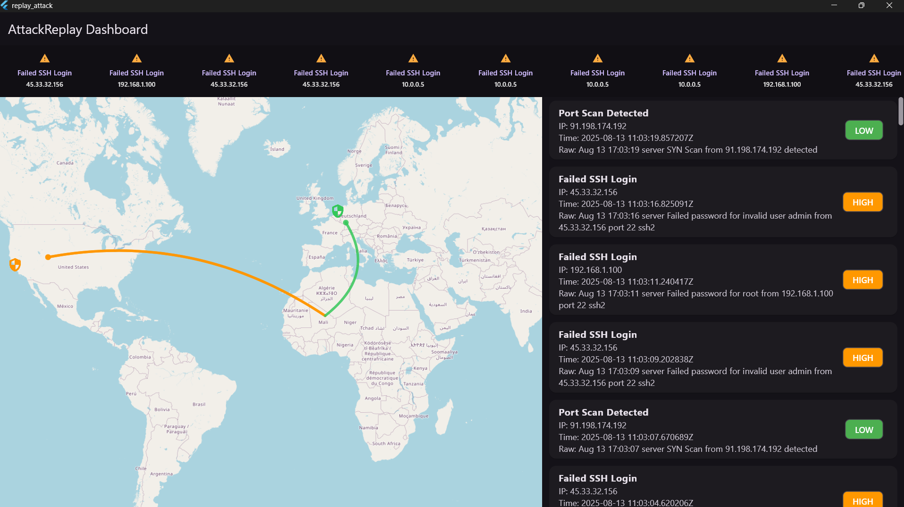

# 🌐 Cyber Attack Live Map

A real-time **Cyber Attack Visualizer** inspired by Norse Attack Map.  
Shows attacks live on a world map using **Flutter (Frontend)** and **FastAPI , WebSockets (Backend)**.  
Perfect for demonstrating **full-stack, real-time data visualization** skills.

---

## 📸 UI

---

## ✨ Features
- 🔌 Real-time WebSocket communication
- 🗺️ Animated arcs between attacker & target
- 📊 Live event feed
- 🎯 Story highlights for high/critical severity attacks
- 🖥️ Cross-platform (Windows, macOS, Linux)

---

## 🏗️ Tech Stack
| Part       | Tech         |
|------------|--------------|
| Frontend   | Flutter, GetX, flutter_map |
| Backend    | FastAPI, WebSockets |
| Protocol   | JSON over WebSocket |

---


## Backend Setup
```
cd backend
pip install -r requirements.txt
uvicorn app:app --reload
```
Runs at: ws://localhost:8000/ws/events

## Frontend Setup

```
cd frontend
flutter pub get
flutter run -d windows   # or macos/linux
```